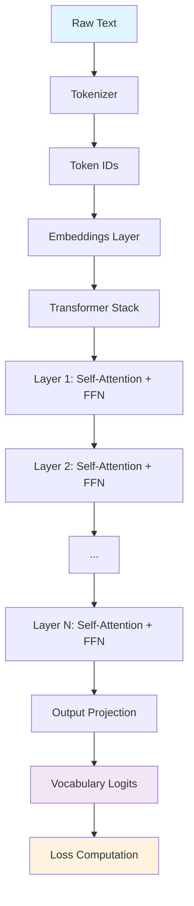

# 📂 Codebase Overview
{: .no_toc }

This page provides a comprehensive guide to the HipGPT codebase architecture and explains the purpose of each component. The project is designed to be **self-contained**, **readable**, and **educational**, allowing you to understand how a GPT-style transformer works from the ground up.

## Table of Contents
{: .no_toc .text-delta }

1. TOC
{:toc}

---

## Project Structure

```
hipgpt/
├── 📁 build/                 # Build outputs (CMake artifacts)
├── 📁 data/                  # Training datasets
│   └── tiny_shakespeare.txt
├── 📁 scripts/               # Automation scripts
│   ├── download_data.sh      # Dataset fetching
│   └── run_train.sh          # End-to-end training
├── 📁 include/               # Public headers
│   ├── gpt_model.h           # Main model interface
│   ├── hip_kernels.h         # GPU kernel declarations
│   ├── tokenizer.h           # BPE tokenizer interface
│   └── transformer_layer.h   # Transformer block interface
├── 📁 src/                   # Implementation files
│   ├── generate.cpp          # Text generation CLI
│   ├── gpt_model.cpp         # Model orchestration
│   ├── hip_kernels.cpp       # GPU kernel implementations
│   ├── tokenizer.cpp         # BPE tokenizer logic
│   ├── train_gpt.cpp         # Training CLI
│   └── transformer_layer.cpp # Transformer block logic
├── CMakeLists.txt            # Build configuration
├── LICENSE                   # MIT License
└── README.md                 # Project documentation
```

---

## Core Components

### 🔤 Tokenizer
{: .d-inline-block }
Essential
{: .label .label-blue }

**Files:** `src/tokenizer.cpp`, `include/tokenizer.h`

The tokenizer implements Byte-Pair Encoding (BPE) from scratch, handling the conversion between human-readable text and model-compatible token sequences.

**Key Responsibilities:**
- **Vocabulary Training** — Learns subword tokens from training corpus
- **Text Encoding** — Converts strings to token ID sequences  
- **Text Decoding** — Reconstructs text from token sequences
- **Serialization** — Saves/loads trained vocabulary using JSON

**Usage Example:**
```cpp
Tokenizer tokenizer;
tokenizer.train("data/tiny_shakespeare.txt", vocab_size=1000);
auto tokens = tokenizer.encode("Hello, world!");
std::string text = tokenizer.decode(tokens);
```

---

### 🧠 Transformer Layer
{: .d-inline-block }
Core
{: .label .label-green }

**Files:** `src/transformer_layer.cpp`, `include/transformer_layer.h`

Implements a single GPT-style transformer block containing the fundamental attention and feed-forward mechanisms.

**Architecture Components:**
- **Multi-Head Self-Attention** — Parallel attention heads with QKV projections
- **Feed-Forward Network** — Two-layer MLP with ReLU activation
- **Residual Connections** — Skip connections around attention and FFN
- **Layer Normalization** — Pre-normalization for stable training
- **Dropout** — Regularization during training phase

**Key Features:**
- Each layer manages its own GPU memory and optimizer states
- Supports both training (with gradients) and inference modes  
- Configurable head count, hidden dimensions, and dropout rates

---

### 🏗️ GPT Model
{: .d-inline-block }
Architecture
{: .label .label-purple }

**Files:** `src/gpt_model.cpp`, `include/gpt_model.h`

The main model class that orchestrates the complete GPT architecture by combining embeddings, transformer layers, and output projections.

**Model Pipeline:**
1. **Token Embeddings** — Maps token IDs to dense vectors
2. **Positional Embeddings** — Adds position information  
3. **Transformer Stack** — Sequential transformer layers
4. **Output Projection** — Linear layer to vocabulary logits
5. **Loss Computation** — Cross-entropy for training

**Training Features:**
- Automatic gradient computation and backpropagation
- Adam optimizer with configurable learning rate
- Checkpoint saving and loading
- Memory-efficient batch processing

---

### ⚡ HIP Kernels
{: .d-inline-block }
Performance
{: .label .label-yellow }

**Files:** `src/hip_kernels.cpp`, `include/hip_kernels.h`

Custom GPU kernels implemented in AMD HIP, providing transparent and educational implementations of all neural network operations.

**Implemented Operations:**

| Kernel Category | Operations |
|:----------------|:-----------|
| **Linear Algebra** | Matrix multiplication, bias addition, transpose |
| **Attention** | Multi-head QKV computation, scaled dot-product attention |
| **Activations** | ReLU, Softmax, GELU |
| **Normalization** | Layer normalization, dropout |
| **Training** | Cross-entropy loss, accuracy computation, gradient updates |

**Design Philosophy:**
- **Educational Transparency** — No black-box external libraries
- **Performance Optimized** — Efficient memory access patterns
- **Numerically Stable** — Careful handling of floating-point operations

---

## Application Entry Points

### 🎯 Training Pipeline
{: .d-inline-block }
CLI
{: .label .label-red }

**File:** `src/train_gpt.cpp`

Complete training workflow from raw text to trained model.

**Training Process:**


**Command-line Interface:**
```bash
./build/train_gpt \
  --data data/tiny_shakespeare.txt \
  --vocab_size 1000 \
  --seq_length 128 \
  --batch_size 32 \
  --learning_rate 3e-4 \
  --epochs 10
```

---

### 🔮 Text Generation
{: .d-inline-block }
CLI
{: .label .label-red }

**File:** `src/generate.cpp`

Interactive text generation interface for trained models.

**Generation Features:**
- **Top-k Sampling** — Selects from k most likely tokens
- **Temperature Control** — Adjusts randomness in generation
- **Prompt Conditioning** — Starts generation from user input
- **Real-time Output** — Streams generated text as it's produced

**Usage Example:**
```bash
./build/generate \
  --model checkpoints/model_final.bin \
  --tokenizer checkpoints/tokenizer.json \
  --prompt "To be or not to be" \
  --max_tokens 100 \
  --temperature 0.8
```

---

## Build System & Scripts

### 🔧 CMake Configuration
{: .d-inline-block }
Build
{: .label .label-grey }

**File:** `CMakeLists.txt`

- Configures HIP compilation with `hipcc`
- Automatically fetches nlohmann/json for serialization
- Sets up proper include paths and linking
- Supports both Debug and Release configurations

### 📜 Helper Scripts
{: .d-inline-block }
Automation
{: .label .label-grey }

**Data Management:**
```bash
# Download training dataset
./scripts/download_data.sh
```

**Training Automation:**
```bash  
# Complete training pipeline
./scripts/run_train.sh [custom_args...]
```

---

## Data Flow Architecture

The following diagram illustrates how data flows through the HipGPT system:



---

## Getting Started

1. **Clone and Build:**
   ```bash
   git clone <repository-url>
   cd hipgpt
   mkdir build && cd build
   cmake .. && make -j
   ```

2. **Download Data:**
   ```bash
   ./scripts/download_data.sh
   ```

3. **Train Model:**
   ```bash
   ./scripts/run_train.sh
   ```

4. **Generate Text:**
   ```bash
   ./build/generate --model checkpoints/model_final.bin
   ```

---

## Summary

HipGPT's architecture follows a clean, modular design that makes transformer internals accessible:

- **🔤 Tokenizer** — Handles text ↔ token conversion
- **🧠 TransformerLayer** — Implements core attention mechanism  
- **🏗️ GPTModel** — Orchestrates the complete architecture
- **⚡ HIP Kernels** — Provides efficient GPU operations
- **🎯 Training/Generation** — Delivers end-to-end workflows

This design enables you to trace the complete journey from **raw text → tokens → embeddings → attention → logits → generated text** with full transparency at every step.

{: .highlight }
> **Educational Goal:** Every component is implemented from scratch to maximize learning and understanding of transformer architecture internals.